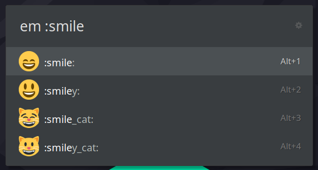

# Emoji Extension

<table>
  <tr>
    <td></td>
    <td></td>
  </tr>
</table>

## Update emoji data

Install dependencies

```bash
python3 -m venv --system-site-packages .venv
source .venv/bin/activate
pip install -r requirements-dev.txt
```

Run the script to update emoji data

```bash
./scrape-emojis.sh
```

## Features

- Supports Apple and Noto emoji preview renders
- Search by emoji name, *or* by shortcode by beginning the search with `:`
- Support for multiple skin tones via settings

### Settings


## Credits

- [emojipedia.org](https://emojipedia.org/) for emoji shortcode data
- [noto-emoji](https://github.com/googlefonts/noto-emoji) for emoji styles :heart:.
