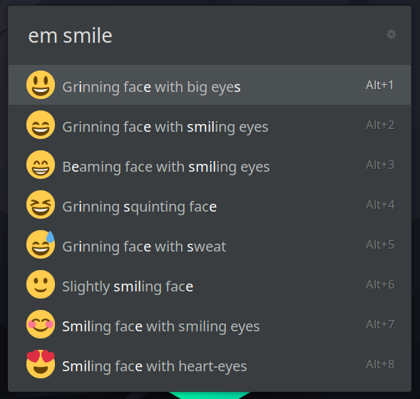
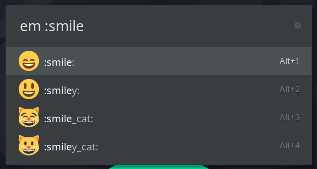
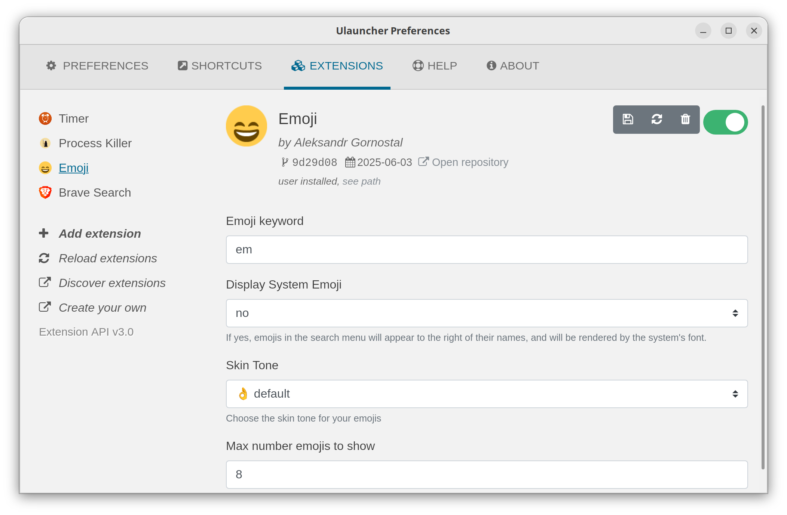

# Emoji Extension

<table>
  <tr>
    <td></td>
    <td></td>
  </tr>
</table>

## Update emoji data

Install dependencies

```bash
python3 -m venv --system-site-packages .venv
source .venv/bin/activate
pip install -r requirements-dev.txt
```

Run the script to update emoji data

```bash
./scrape-emojis.sh
```

## Tests

```bash
python3 -m venv --system-site-packages .venv
source .venv/bin/activate
pip install -r requirements-test.txt
pytest
```

`--system-site-packages` is required because `main.py` imports PyGObject
(`gi`/`Gtk`), which isn't pip-installable.

## Features

- Supports Apple and Noto emoji preview renders
- Search by emoji name, *or* by shortcode by beginning the search with `:`
- Support for multiple skin tones via settings
- Remembers recently used emoji and shows them when the search box is empty; list length is configurable in settings
- `Alt+Enter` on any result pages forward, same as clicking "View more"

### Settings



## Credits

- [emojibase.dev](https://emojibase.dev/) for emoji shortcode data :heart:
- [noto-emoji](https://github.com/googlefonts/noto-emoji) for emoji styles :heart:.

## License

Distributed under the Apache License 2.0. See `LICENSE` for details.
